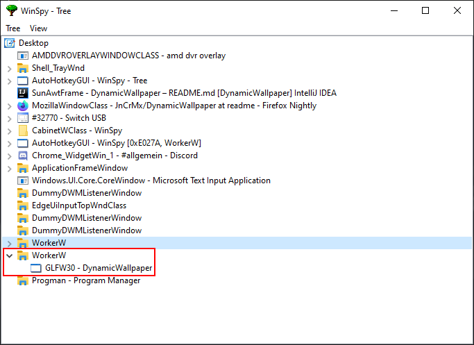

# DynamicWallpaper

*DynamicWallpaper* is a small Java program for playing a video 
as a wallpaper and settings up dynamic colors (e.g. based on 
your open processes or windows).

## Installation

First of all make sure that your platform is supported (or just don't care and go experiment a bit :wink:).

### Supported platforms

|                 OS |            32-bit |                                                 64-bit |
|--------------------|-------------------|--------------------------------------------------------|
|Windows 10          |:question:not tried|                                   :heavy_check_mark:yes|
|Linux (KDE Plasma)  |:question:not tried|:warning:[not really](#why-doesnt-it-work-well-on-linux)|
|Linux (GNOME)       |:question:not tried|              :x:[no](#whats-the-problem-on-gnomeubuntu)|

*Note: It's not very likely that it will work on 32-bit systems if it doesn't work on 64-bit systems.*

### Build from source

To build the application from source make sure you have a JDK (at least 8) installed and properly set up.
It's all just about *Gradle* working well, so don't worry.

Now, download the source from GitHub using ``git clone``
(alternatively you could also download and extract a zipped version of the repository):
```bash
git clone https://github.com/JnCrMx/DynamicWallpaper
```

Then build the application using *Gradle*:

*Windows (in CMD)*
```bash
gradlew.bat build
```

*Unix (in bash)*
```bash
chmod +x gradlew
./gradlew build
```

### Launching the application

There are different ways to launch the application *Gradle* has built in the previous step.

#### Use a *shadowJar*

You can find the *shadowJar* in ``build/libs/DynamicWallpaper-<version>-all.jar``.
It already contains all required libraries.
Simply copy it to any location you like and double-click it to launch.

#### Use a distribution

Besides the *shadowJar* there are also distribution archives.
Those also contain all libraries, but must be extracted before using the application.

You can find them in ``build/distributions/DynamicWallpaper-1.0.zip`` or ``build/distributions/DynamicWallpaper-1.0.tar``.
Just extract them to any directory you want.

After extracting them, just open the ``bin/``-directory and then
execute ``DynamicWallpaper.bat`` (for Windows) or ``DynamicWallpaper`` (for Unix).

#### Use *Gradle*

You can also ask *Gradle* to run the application:

*Windows (in CMD)*
```bash
gradlew.bat run
```

*Unix (in bash)*
```bash
chmod +x gradlew
./gradlew run
```

If you use this way, you don't need to rebuild the program if the source changes.
Building the program is included in this command. 

## Development

### How does it work?

The basic idea is to put a window between your desktop background and the desktop
symbols. In this window we can then do basically anything we want.

On Windows there is a window called "WorkerW" which can be used as a parent for our window.



*Screenshot from [WinSpy](https://sourceforge.net/projects/winspyex/)
with WorkerW and our frame highlighted*

The whole procedure is from a very similar project
I really recommend having a look at:
https://github.com/Francesco149/weebp

This program just replicates the steps in Java using [JNA](https://github.com/java-native-access/jna)
to invoke the required native functions.

For code and detailed information have a look at 
[src/main/java/de/jcm/dynamicwallpaper/Utils.java](src/main/java/de/jcm/dynamicwallpaper/Utils.java).

### Why doesn't it work well on Linux?

I've experimented a bit on Linux and searched for ways to put a window
as a wallpaper, but at least with KDE Plasma none of them really worked.

This is because the desktop background and the desktop icons appear to be
in the same windows. Hence, it seems to be impossible to put a window between
them.

We change the property ``_NET_WM_WINDOW_TYPE`` of our window to
``_NET_WM_WINDOW_TYPE_DESKTOP`` which makes it appear as the desktop window.
Sadly our window is still above the original desktop window and therefore
covers all symbols and prevents you from interacting with your desktop.

Making sure our window is below the desktop seems hard and wouldn't really help,
because then the desktop window (which included the desktop background) would
cover our window instead.

I need to experiment a bit more;
maybe setting a transparent wallpaper could fix this.

### What's the problem on GNOME/Ubuntu?

The application uses an icon in the system tray which you can click to open
or close the configuration window.

Ubuntu/GNOME does not support the system tray anymore.

There might be some plugins providing a system tray, but I haven't tested them yet.
