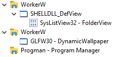

.. _LWJGL: https://www.lwjgl.org/
.. _JNA: https://github.com/java-native-access/jna
.. _WinSpy: https://sourceforge.net/projects/winspyex/
.. _weebp: https://github.com/Francesco149/weebp
.. _Francesco149: https://github.com/Francesco149

.. |AtomicReference| replace:: ``AtomicReference``
.. _AtomicReference: https://docs.oracle.com/javase/8/docs/api/java/util/concurrent/atomic/AtomicReference.html

.. |EnumWindows| replace:: ``EnumWindows``
.. _EnumWindows: https://docs.microsoft.com/en-us/windows/win32/api/winuser/nf-winuser-enumwindows

.. |FindWindowEx| replace:: ``FindWindowEx``
.. _FindWindowEx: https://docs.microsoft.com/en-us/windows/win32/api/winuser/nf-winuser-findwindowexa

.. |hWndChildAfter| replace:: ``hWndChildAfter``
.. _hWndChildAfter: https://docs.microsoft.com/en-us/windows/win32/api/winuser/nf-winuser-findwindowexa#parameters

.. |SetParent| replace:: ``SetParent``
.. _SetParent: https://docs.microsoft.com/en-us/windows/win32/api/winuser/nf-winuser-setparent

.. |ShowWindow| replace:: ``ShowWindow``
.. _ShowWindow: https://docs.microsoft.com/en-us/windows/win32/api/winuser/nf-winuser-showwindow

.. |glfwShowWindow| replace:: ``glfwShowWindow``
.. _glfwShowWindow: https://javadoc.lwjgl.org/org/lwjgl/glfw/GLFW.html#glfwShowWindow(long)

How it works: Step by Step
==========================

Opening a window with an OpenGL context
----------------------------------------

The first step is to get hold on a window in which we can render with OpenGL.
For that we simply use `LWJGL`_.
The code basically follows the structure of the example you can find on `their website <https://www.lwjgl.org/guide>`_.

Setting a window as wallpaper
-----------------------------

The theory behind it
^^^^^^^^^^^^^^^^^^^^

The basic idea is to put a window between your "normal" desktop background and the desktop symbols.

.. NOTE::
    I took most of the procedure from the project "`weebp`_" by `Francesco149`_.

    I really recommend you having a look at it, if you are interested in more details about it.
    It also provides more features (setting any window as wallpaper).

There is a pretty nice and useful window we can use for that.
It is called ``WorkerW`` and lies exactly where we want it to be.

.. figure:: /../img/WorkerW.png

    Screenshot from `WinSpy`_ showing ``WorkerW`` and our window.

To utilize this, we now need to ask ``Progman`` to spawn this window if it doesn't already exists, and then
make our own window a child of ``WorkerW``.

.. NOTE::
    `Here <https://www.codeproject.com/Articles/856020/Draw-Behind-Desktop-Icons-in-Windows-plus?msg=5478543#xx5478543xx>`_
    is another useful resource about this, which also explains how ``WorkerW`` is spawned.

Java implementation
^^^^^^^^^^^^^^^^^^^

After calling ``glfwCreateWindow`` and receiving a GLFW handle to the window,
we can start setting it as our wallpaper. This is basically where the magic happens.

.. code-block:: java
    :linenos:
    :lineno-start: 404
    :emphasize-lines: 2, 8

    // Create the window
    window = glfwCreateWindow(mode.width(), mode.height(), "DynamicWallpaper", NULL, NULL);
    if(window == NULL)
        throw new RuntimeException("Failed to create the GLFW window");
    glfwSetWindowPos(window, 0, 0); // I will explain those two later
    glfwSetWindowSize(window, mode.width(), mode.height());

    Utils.makeWallpaper(window);

The beginning
"""""""""""""

So, let's have a look into the ``de.jcm.dynamicwallpaper.Utils`` class:

.. code-block:: java
    :linenos:
    :lineno-start: 58

    public static void makeWallpaper(long window)
    {
        if(Platform.isWindows())
            windowsMakeWallpaper(window);
        else
            throw new UnsupportedOperationException("only available on Windows");
    }

This first method is used to eventually support multiple platforms.
Currently it only really supports Windows, so we just check if we are on Windows using `JNA`_
(see `<https://java-native-access.github.io/jna/4.2.1/com/sun/jna/Platform.html#isWindows-->`_ for details).
If we aren't on Windows, we just throw a ``java.lang.UnsupportedOperationException`` and return.

If everything is right, we call ``Utils.windowsMakeWallpaper`` and continue our journey there:

Native window handles
"""""""""""""""""""""

.. code-block:: java
    :linenos:
    :lineno-start: 74

    private static void windowsMakeWallpaper(long window)
    {
        long nativeWindow = GLFWNativeWin32.glfwGetWin32Window(window);

        // procedure from https://github.com/Francesco149/weebp
        WinDef.HWND thisWindow = new WinDef.HWND(new Pointer(nativeWindow));

Here we want to operate on the window as the OS (Windows) sees it and not as GLFW sees it.
Therefore, we need to ask GLFW to give us the "native" handle of our window.
In the rest of the method we only work with this one and **not** with GLFW's handle.
You can safely assume that every window handle in this section mean the native handle.
The next step is to wrap the returned handle into `JNA`_'s / Windows' structure for Window handles.
This makes it easier for us to operate with it and pass it to other JNA functions.

.. code-block:: java
    :linenos:
    :lineno-start: 80

    WinDef.HWND workerW = getWorkerW();

Now we need to spawn and find the ``WorkerW`` which we do in a separate method.

Spawning ``WorkerW``
""""""""""""""""""""

To spawn ``WorkerW`` all we need to do is sending two (undocumented) messages to ``Progman``.

.. code-block:: java
    :linenos:
    :lineno-start: 30

    private static WinDef.HWND getWorkerW()
    {
        WinDef.HWND progman =  User32.INSTANCE.FindWindow("Progman", null);

        User32.INSTANCE.SendMessage(progman, 0x052C, new WinDef.WPARAM(0xD), new WinDef.LPARAM(0));
        User32.INSTANCE.SendMessage(progman, 0x052C, new WinDef.WPARAM(0xD), new WinDef.LPARAM(1));

To do so, we first need to find ``Program`` (line 32) and then we can just send the messages (lines 34-35).

.. NOTE::
    We need to wrap some arguments in ``WinDef.WPARAM`` and ``WinDef.LPARAM``,
    because JNA does not do that automatically and the Windows API requires it.

Finding ``WorkerW``
"""""""""""""""""""

The problem with finding ``WorkerW`` is that - as you can see in the figure below - there are two ``WorkerW`` windows:
One of them contains a window with the class ``SHELLDLL_DefView`` and the other one will contain our frame.

    Screenshot from `WinSpy`_ showing both ``WorkerW`` windows.

Hence we need a way to "skip" the first one and then find the second one.

.. code-block:: java
    :linenos:
    :lineno-start: 37
    :emphasize-lines: 2, 7, 10

    AtomicReference<WinDef.HWND> workerRef = new AtomicReference<>();
    User32.INSTANCE.EnumWindows(new WinUser.WNDENUMPROC()
    {
        @Override
        public boolean callback(WinDef.HWND hWnd, Pointer data)
        {
            if(User32.INSTANCE.FindWindowEx(hWnd, null, "SHELLDLL_DefView", null)==null)
                return true;

            WinDef.HWND worker = User32.INSTANCE.FindWindowEx(null, hWnd, "WorkerW", null);
            if(worker != null)
            {
                workerRef.set(worker);
            }

            return true;
        }
    }, null);
    return workerRef.get();

At the very beginning of this part we need to create an |AtomicReference|_ to store the result.
We need this, because we will be operating within an inner class and are therefore
unable to directly set local variables outside this inner class.

Now, we iterate over all top-level windows on the screen using |EnumWindows|_:

For each of those windows we then check if it contains the ``SHELLDLL_DefView`` window.
So, we basically search for the first ``WorkerW`` (the one we don't want).
If we found this ``WorkerW`` we proceed with our code
otherwise we return ``true`` and continue our search with the next top-level window.

To find the ``WorkerW`` we actually need, we search for a ``WorkerW`` in the root window using |FindWindowEx|_.
To avoid finding the "wrong" one (which is the one we just found in the previous step), we tell the method to
start searching after the first ``WorkerW`` which results in it returning the second one.
We do this by simply passing a handle to the wrong one to |FindWindowEx|_ as the second parameter (|hWndChildAfter|_).

If we successfully found such a window, we put it into our ``AtomicReference``.

.. NOTE::
    At this point we could return ``false`` to stop iterating over the top-level windows.
    To be honest I'm not sure why I don't do this.

Finally, we return the handle to the ``WorkerW`` we (hopefully) found and stored in the ``AtomicReference``.

Modifying our window styles
"""""""""""""""""""""""""""

Returning to the ``de.jcm.dynamicwallpaper.Utils.windowsMakeWallpaper`` method, we now need to adjust
some window styles to make it work as wallpaper.

.. code-block:: java
    :linenos:
    :lineno-start: 85

    long style = User32.INSTANCE.GetWindowLong(thisWindow, User32.GWL_STYLE);
    style &= ~(
            WS_CAPTION |
                    WS_THICKFRAME |
                    WS_SYSMENU |
                    WS_MAXIMIZEBOX |
                    WS_MINIMIZEBOX
    );
    style |= User32.WS_CHILD;
    User32.INSTANCE.SetWindowLong(thisWindow, User32.GWL_STYLE, (int) style);

    // not sure if we need those, but better keep them in
    long exStyle = User32.INSTANCE.GetWindowLong(thisWindow, User32.GWL_EXSTYLE);
    exStyle &= ~(
            WS_EX_DLGMODALFRAME |
                    WS_EX_COMPOSITED |
                    WS_EX_WINDOWEDGE |
                    WS_EX_CLIENTEDGE |
                    WS_EX_LAYERED |
                    WS_EX_STATICEDGE |
                    WS_EX_TOOLWINDOW |
                    WS_EX_APPWINDOW
    );
    User32.INSTANCE.SetWindowLong(thisWindow, User32.GWL_EXSTYLE, (int) exStyle);

There are certain styles we apparently need to remove from our window.
Doing that is really simple by just getting the current styles, removing the flags using a bitwise and
with the bitwise compliment of the flags we want to remove, and finally setting the modified styles.

.. NOTE::
    The style blacklist is taken from
    https://github.com/Codeusa/Borderless-Gaming/blob/2fef4ccc121412f215cd7f185c4351fd634cab8b/BorderlessGaming.Logic/Windows/Manipulation.cs#L70

Making ``WorkerW`` adopt our window
"""""""""""""""""""""""""""""""""""

Making the ``WorkerW`` we just found adopt our window
(so it becomes our window's parent and we inherit its stacking position)
is rather simple:

.. code-block:: java
    :linenos:
    :lineno-start: 110

    User32.INSTANCE.SetParent(thisWindow, workerW);
    User32.INSTANCE.ShowWindow(thisWindow, User32.SW_SHOW);

We just call |SetParent|_ to set ``WorkerW`` as our parent and then make our window visible using |ShowWindow|_.

.. NOTE::
    To be honest I'm not sure if the ``ShowWindow`` step is neccessary, because we will make the window visible using
    GLFW's |glfwShowWindow|_ later.

    Buf it probably won't hurt since the documentation states the following:

        If the window is already visible or is in full screen mode, this function does nothing.

**Done!**

Adjusting position and size
"""""""""""""""""""""""""""

*Almost* done.

We still need to take care about one small thing mainly related to decorated and undecorated windows in GLFW.

The problem is that our window needs to be decorated (or it won't work for some reason) and is therefore a bit smaller
than the actual screen and won't cover the whole desktop background.

.. code-block:: java
    :linenos:
    :lineno-start: 82

    WinDef.RECT rect = new WinDef.RECT();
    User32.INSTANCE.GetWindowRect(thisWindow, rect);

The fix this we first need to store our window's size before modifying its styles and making it the wallpaper.

.. code-block:: java
    :linenos:
    :lineno-start: 113

    // not sure wtf we do here, but it seems to work (not really well, but idk)
    User32.INSTANCE.MoveWindow(thisWindow, 0, rect.top, rect.right,
                               rect.bottom+10, false);
    rect.clear();

Then after setting our parent to ``WorkerW``, we move our window to its previous position and add ``10`` to its height.
I'm not sure why this works, but it does.
Finally we release the ``WinDef.RECT`` we allocated.

.. NOTE::
    This is also the reason why we need to set the window position and size via GLFW after creating the window:

    .. code-block:: java
        :linenos:
        :lineno-start: 408

        glfwSetWindowPos(window, 0, 0);
        glfwSetWindowSize(window, mode.width(), mode.height());

And now we are *really* **done**!
