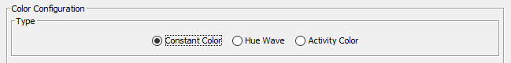

Color Modes
===========

``Color Modes`` are a way of dynamically coloring the video.
An example for that is specifying different colors for different activities (programs, active windows, etc.).

Each color mode comes with its own configuration which is documented individually.

You can select the color mode you want to use with these radio buttons in the configuration UI:

    Color mode selection UI.

.. toctree::
    :caption: Available color modes
    :maxdepth: 1

    color-modes/constant-color
    color-modes/hue-wave
    color-modes/activity-color
