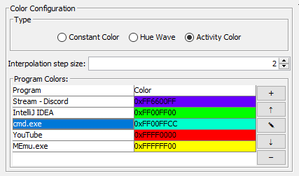
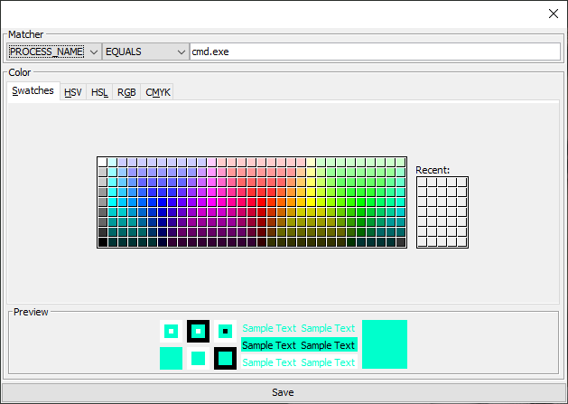

.. _Cynder: https://www.youtube.com/channel/UC9MyqNyETaTxPzqAAW1RjAQ
.. |add| unicode:: U+002B
.. |up| unicode:: U+2191
.. |edit| unicode:: U+270E
.. |down| unicode:: U+2193
.. |del| unicode:: U+2012

Activity Color
==============

The Activity Color mode provides color accents based on the currently open programs/windows.

.. note::
    This mode is the original reason for this programs very existance.
    Huge thanks to `Cynder`_ who really motivated and inspired me to create this.

The configuration of this mode is a bit more complicated, since it can handle activities and corresponding colors.

    Configuration panel of this mode.

Interpolation step size
-----------------------

This mode makes the color change slowly when the activity is changed.
The speed of the change is controlled by this option.

Higher values (maximum of 256 means immediate) increase the speed of the change
and lower values decrease it.

.. warning::
    A value of ``0`` will completely prevent the color from changing and hence the mode from working.

Program colors
--------------

The activities and their corresponding colors are defined in the "Program colors" table.
They order of the entries is important.
Entries with higher position in the table override entries with lower position.

They can be selected by clicking them.

The buttons on the right side have the following effects:

+--------+------------------------------------------------------------------------------+-----------------------------------------------------+
| Button | Effect                                                                       | Availability                                        |
+========+==============================================================================+=====================================================+
|  |add| | Opens a :ref:`dialog <Add/Modify entry dialog>` to add a new entry.          | always                                              |
+--------+------------------------------------------------------------------------------+-----------------------------------------------------+
|   |up| | Move the selected entry one position up.                                     | if an entry is selected and it is not the first one |
+--------+------------------------------------------------------------------------------+-----------------------------------------------------+
| |edit| | Opens a :ref:`dialog <Add/Modify entry dialog>` the edit the selected entry. | if an entry is selected                             |
+--------+------------------------------------------------------------------------------+-----------------------------------------------------+
| |down| | Move the selected entry one position down.                                   | if an entry is selected and it is not the last one  |
+--------+------------------------------------------------------------------------------+-----------------------------------------------------+
| |del|  | Removes the selected entry.                                                  | if an entry is selected                             |
+--------+------------------------------------------------------------------------------+-----------------------------------------------------+

Add/Modify entry dialog
-----------------------

    Dialog for adding/modifying entries.

In this dialog you need to configure two things:

Matcher
^^^^^^^

Using the "Matcher" options in the top of the dialog you can select the program or window to match:

#. Select either ``PROCESS_NAME`` (for matching processes/programs) or ``WINDOW_TITLE`` (for matching individual windows).
#. Specify how to match the previously selected *thing*:

    - ``EQUALS`` is used for *exact* matching.
    - ``STARTS_WITH`` and ``ENDS_WITH`` match things starting or ending with the given string.
    - ``CONTAINS`` matches things that contain the given string.

#. Provide a string to search for in the text field (which says ``cmd.exe`` in the example screenshot).

.. warning::
    The matcher is **case-sensitive**.

Color
^^^^^

To complete the configuration simply select a color using the standard color chooser.

Add or Save
^^^^^^^^^^^

The button in the bottom of the dialog says either "Add" or "Save"
(depending on if you are adding of modifying an entry).

Click it to add the entry to the list or
to save your changes to the existing entry you are modifying.
