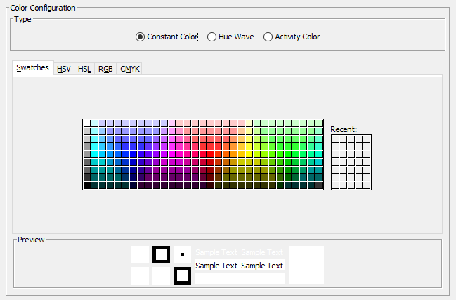

Constant Color
==============

The constant color mode provides - as you might have already guessed due to its name - a constant color.
It can also be used to play a video without any color changes by simply setting the color to white.

The color to use can be selecting using the color picker in the UI:

    Configuration panel of the "Constant Color" mode.
