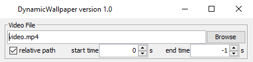

Configuring the wallpaper
=========================

The GUI also offers several configuration options for the wallpaper.

    General configuration

The main options in this general configuration are about the video to use as the dynamic wallpaper.

Video file path
---------------

The video file path can be set in the big text field (which in the screenshot shows "video.mp4").
This path can be either relative or absolute. See :ref:`Relative path` for more details.

You can click the "Browse" button to open a file chooser dialog to help you find the video file you want to use.

Furthermore, it is also possible to use URLs (also YouTube is the right tools are installed) in this field.
Refer to :ref:`Using videos from YouTube` for more information about YouTube and other video portals.

Relative path
-------------

Using this checkbox you can control how the program stores the path.

If it is checked it will try to store it as a relative path to the working directory.
This might be useful if you want to be able to move the program together with the configuration and
video file to another location or device.

.. warning::
    It might not be possible for the program to store it as a relative path,
    e.g. due to different roots / drives.
    This might happen if for example the program runs somewhere on ``C:\`` and the video is located on ``D:\``.
    In this case the path is stored as an absolute path.

If the video path is an URL this option has no effect and
might be automatically set or unset after restarting the program.

Start and stop time
-------------------

With the fields "start time" and "stop time" you can specify the timestamp at which the video should
start and the timestamp at which it should restart from the beginning (aka the timestamp you specified as
the start time).

Both timestamps are in seconds relative to the beginning of the video.

To use default values (aka start and end of the actual video), set "start time" to ``0``
(which of course **is** the actual start of the video) and "stop time" to ``-1``
(which tells the program to ignore this setting and use the regular video end).

.. note::
    If the video is playing from the internet and finished caching, changing the stop time will cause the cache
    to be deleted and therefore the caching to restart.

    This is required, because the caching will finish if the stop time is reached,
    regardless of whether the end of the actual video is reached or not.
    Without this re-downloading the video will replay at the old stop time,
    because the end of the cached is reached.

For information about color modes (which you can also configure in the UI), refer to :ref:`Color Modes`.
