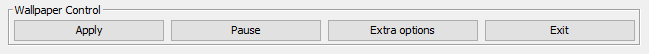

Controlling the wallpaper/application
=====================================

Controlling the wallpaper can be done using three of the four buttons in the bottom of the GUI:

Apply
-----

The "Apply" button is used to apply the changes you made in the configuration
(see :ref:`Configuring the wallpaper`) to the wallpaper.

It also saves these changes.

Pause / Play
------------

Using the "Pause" button you can pause the video playback and all active overlays (see :ref:`Overlays`).
Dynamic colors are currently not paused, but I'm going to fix that soon.

Once you paused the application, the buttons text changes to "Play".
Clicking it then resumes video playback and overlays.

.. note::
    Pausing and resuming overlays doesn't work very well. This should not inflict functionality,
    but might cause some skipped frames/render issues.

Exit
----

Clicking "Exit" will prompt you with a dialog to either save or discard changes you made.
After choosing your side (and optionally saving the configuration) the application terminates gracefully.
