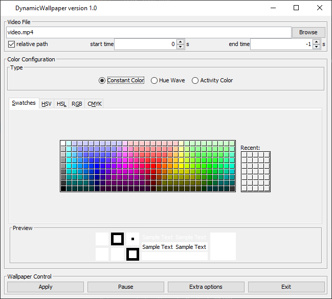

User Interface
==============

You can easily control and configure the wallpaper with a simple user interface.
To open (or close) this GUI click on the tray icon that appeared in your task bar after launching the program.

    Tray icon in the task bar / system tray (marked with red rectangle)

.. note::
    You can use all mouse buttons to open/close the GUI.
    I'd like to implement a popup-menu, but for some reason it just doesn't work.

The GUI should look like this:

You can do the following things in the GUI:

.. toctree::
    :maxdepth: 1

    ui-control
