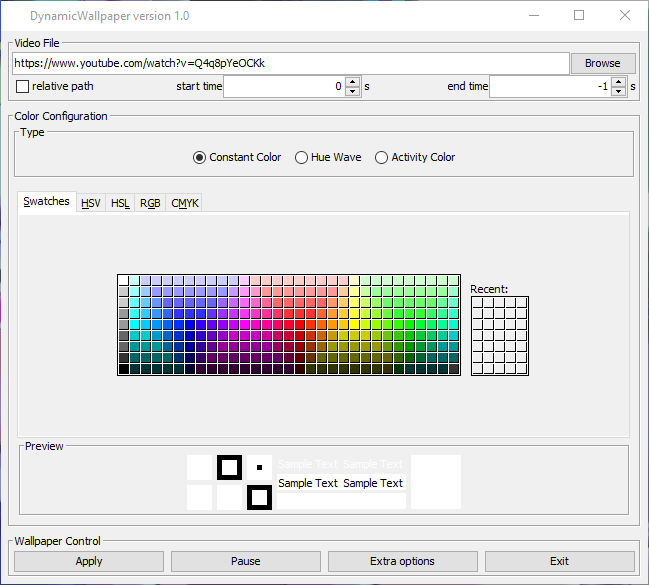

.. _youtube-dl: https://youtube-dl.org/

Using videos from YouTube
=========================

In order to use videos from platforms like YouTube as your wallpaper you just need
to have `youtube-dl`_ installed.

.. caution::
    Make also sure that the location you installed it to is in your ``PATH`` or it won't work.
    You can check this by trying to run ``youtube-dl`` from CMD (or Bash if you are on Linux).
    If that works, everything should be fine.

Now, you can simply enter an URL in the "Video File" text field and click apply.
It might take some time to load, but then it should be playing the video as your wallpaper.

.. warning::
    It does not work with every video, because the format this program needs is not
    available for every video.
    This issue seems to be most likely to happen with less popular videos.

    Configuration to use a YouTube `video <https://www.youtube.com/watch?v=Q4q8pYeOCKk>`_
    as wallpaper.

.. note::
    It might also work with other sites supported by youtube-dl, but I haven't tried,
    so you need to experiment a bit. ;)

While playing the video for the first time, it is cached into a file (``cache.mp4``).
On the second playback is it played from this file which makes it faster and more stable.

.. warning::
    Sometimes (e.g. if the program terminates abnormally and could not finish caching)
    the cached video might be empty or incomplete.
    In such cases you just need to manually delete the cache,
    so the video is downloaded again.
